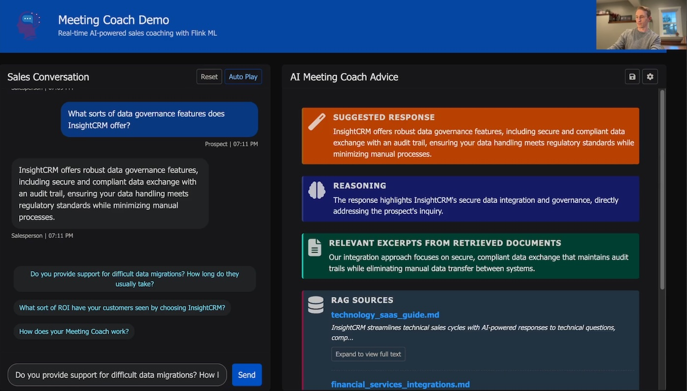

# Flink AI Meeting Coach — Real-time Sales Coaching with RAG

This project demonstrates a real-time AI "Meeting Coach" showcasing the use of Confluent Cloud for Apache Flink AI Inference functions to build a real-time Retrieval-Augmented Generation (RAG) pipeline. The demo uses both a static knowledge base of sales documents and real-time simulated meeting data.

## Architecture


The Meeting Coach system consumes a chat stream representing a sales meeting. When specific triggers occur (like a customer raising a price objection), it uses a RAG pipeline to retrieve relevant context from a knowledge base of company documents (e.g., battlecards, sales materials, previous meeting notes, objection handling tips) stored in a vector database, and generates real-time coaching suggestions for the salesperson using an LLM.

## 🚀 Quick Start Deployment

This guide helps you deploy the complete Flink ML Demo infrastructure from scratch with **minimal credentials**.

### Prerequisites

You need accounts and API credentials for:
1. **Confluent Cloud** (for Kafka + Flink)
2. **Microsoft Azure** (for OpenAI services)
3. **MongoDB Atlas** (for vector database)

⚠️ **MongoDB Atlas M0 Shared Tier**
- This deployment uses **MongoDB Atlas M0 Free Tier**
- **Note**: M0 free tier cluster cannot be created via Terraform API - must be created manually in Atlas UI

### Step 1: Get Required Credentials

#### 1.1 Confluent Cloud API Keys

1.1. Go to [Confluent Cloud](https://confluent.cloud/settings/api-keys)
1.2. Create a new **Cloud API Key** (not cluster-specific)
1.3. Note down: `API Key` and `API Secret`

#### 1.2 Azure Service Principal

1.4. Go to [Azure Portal](https://portal.azure.com) > App registrations
1.5. Create a new app registration
1.6. Go to "Certificates & secrets" > New client secret
1.7. Go to "Subscriptions" > Your subscription > Access control (IAM)
1.8. Add role assignment: "Contributor" for your app
1.9. Note down: `Subscription ID`, `Tenant ID`, `Client ID`, `Client Secret`

#### 1.3 MongoDB Atlas API Keys

1.10. Go to [MongoDB Atlas](https://cloud.mongodb.com) > Access Manager > API Keys
1.11. Create new **Organization API Key** with "Project Creator" permissions
1.12. Note down: `Public Key`, `Private Key`, and your `Organization ID`

### Step 2: Configure Environment

2.1. **Copy the template:**
   ```bash
   cp .env.template .env
   ```

2.2. **Open the .env file and fill it out with your credentials:**
   ```bash
   nano .env
   ```

### Step 3: Deploy Infrastructure

3.1. **Initialize Terraform:**
   ```bash
   cd terraform
   terraform init
   ```

3.2. **Load environment variables:**
Make sure to load this command every time before running `terraform plan` or `terraform apply`
   ```bash
   source ./load_tf_vars.sh
   ```

3.3. **Deploy everything:**
   ```bash
   -- make sure to run `source ./load_tf_vars.sh` every time before `terraform apply`
   terraform apply --auto-approve
   ```

### Step 4: Run personalized Flink SQL commands to generate connections, models, and tables in Confluent Cloud

4.1. Run `terraform/generate_personalized_commands.sh` which generates `terraform/personalized_setup_commands.md`, containing personalized Flink SQL commands with your specific deployment details.
```bash
   cd terraform
   ./generate_personalized_commands.sh
```

4.2. Run the personalized Flink SQL statements from `personalized_setup_commands.md` in Confluent Cloud to create Flink connections, models, and tables

Use either the [Confluent Cloud Flink SQL Workspace](https://confluent.cloud/workspaces/) or, if logged into Confluent CLI, use Confluent Flink shell by running:
```bash
confluent flink shell
```

## Data Flow

There are two main tracks that define how data flows within this project:

### Knowledge Base Data Prep Pipeline:
1. **Ingestion**: Generate static, synthetic knowledge base documents (e.g., .txt, .md). Use a method like the Kafka file source connector or a custom producer to send these documents as messages to the `knowledge` Kafka topic.
2. **Processing & Embedding**: A Flink SQL job consumes these documents, chunks them using `ML_CHARACTER_TEXT_SPLITTER`, uses `ML_PREDICT` with the `openaiembed` model to call Azure OpenAI for embeddings, and prepares the data for the vector store.
3. **Storage**: The embedded knowledge is stored in MongoDB Atlas via the `knowledge_mongodb` external table definition and a suitable sink mechanism.

### Real-time Coaching Pipeline:
1. **Input**: Real or simulated chat messages are sent to the `messages_conversation` Kafka topic via the frontend web UI.
2. **Processing**: Flink SQL filters the conversation for prospect messages (`messages_prospect`), then generates embeddings for these messages (`messages_prospect_embeddings`) by calling out to the Azure OpenAI `text-embedding-ada-002` model.
3. **RAG**: The system then uses Flink SQL AI functions to perform vector search against MongoDB Atlas vector database using `VECTOR_SEARCH`, and saves the results (`messages_prospect_rag_results`).
4. **Generation**: The system calls the Azure OpenAI `gpt-4o-mini` model via `ML_PREDICT` using the `coaching_response_generator` model and a custom prompt, including the prospect's recent message, and the retrieved document chunk results from RAG retrieval.
5. **Pipeline result storage**: The original message, along with the relevant document chunks retrieved via RAG search, and the `coaching_response_generator`'s final meeting coaching output, are saved for later review and model retraining to Azure CosmosDB.

## Running the AI MeetingCoach Application UI



1. **Activate Virtual Environment**:
   Before running the application, activate the Python virtual environment. If you haven't created one, you can do so with `python -m venv .venv` or `uv venv`.

   * On macOS/Linux:
     ```bash
     source .venv/bin/activate
     ```
   * On Windows:
     ```bash
     .\.venv\Scripts\activate
     ```

2. **Install Dependencies**:
   Install the required Python packages:
   ```bash
   pip install -r requirements.txt
   ```
   Alternatively, if using `uv`, run:
   ```bash
   uv sync
   ```

3. **Set Environment Variables**:
   Ensure you have have fully filled out the `.env` file in the project root directory with the necessary credentials (see `.env.template` for required variables like Kafka/Schema Registry credentials and Azure OpenAI keys).

4. **Load Knowledge Base** (one-time setup):
   ```bash
   python publish_knowledge_documents.py
   ```

5. **Run the Flask App**:
   Start the Flask development server:
   ```bash
   python app.py
   ```
   The application should now be accessible at `http://127.0.0.1:5000` (or the host/port specified in the output).

## What Gets Created

The Terraform + Flink SQL statements you entered earlier create **everything from scratch**:

### Confluent Cloud
- ✅ New environment
- ✅ Kafka cluster with all topics
- ✅ Flink compute pool
- ✅ Service accounts and API keys
- ✅ MongoDB sink connector

### Microsoft Azure
- ✅ Resource group
- ✅ OpenAI service
- ✅ Text embedding model deployment
- ✅ GPT-4 completion model deployment

### MongoDB Atlas
- ✅ New project
- ✅ M0 Free Tier cluster with vector search support
- ✅ Database user with proper permissions
- ✅ Vector search index (1536 dimensions for OpenAI)
- ✅ IP allowlist for access

## Cleanup

To destroy all resources:
```bash
cd terraform
terraform destroy --auto-approve
```

## Troubleshooting

**"Resource already exists" errors:**
- Change your `DEPLOYMENT_PREFIX` in .env to something unique

**MongoDB connection issues:**
- Wait 2-3 minutes after cluster creation for it to be fully ready
- Ensure your cluster is deployed in `eastus2 (Virigina)` region, same as rest of project infra.
- Whitelist IP 0.0.0.0/0 to enable Confluent to connect

**Azure permission errors:**
- Ensure your service principal has "Contributor" role on the subscription
- Check that the Azure region is `eastus2` for this project - do not change region.

**Confluent connection errors:**
- Verify your Cloud API key is a `Cloud Resource Management` key, and that you've also attached `OrganizationAdmin` permissions to the key (!!)
- Ensure your cluster is deployed in `eastus2 (Virigina)` region, same as rest of project infra.
- Use the exact resource IDs from terraform outputs

## Project Structure

```
├── README.md (this file)
├── .env.template (credential template)
├── requirements.txt (python dependencies)
├── publish_knowledge_documents.py (main utility)
├── app.py (main flask application)
├── terraform/ (infrastructure as code)
├── app/ (application code & assets)
│   ├── routes/ (flask routes)
│   ├── utils/ (utilities)
│   ├── templates/ (html templates)
│   ├── static/ (css, js, images)
│   └── scripts/ (utility scripts)
├── sample-data/ (demo knowledge base)
└── images/ (screenshots & diagrams)
```
